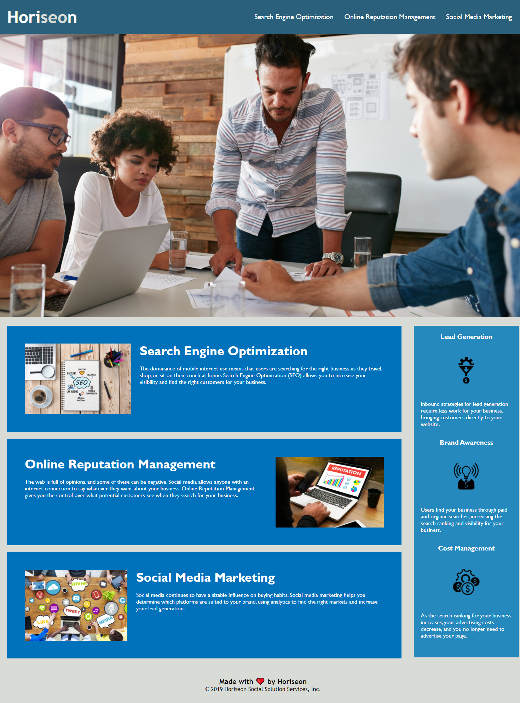

# Description
For this project, I refactored Horiseon's website because they needed increased accessibility and efficiency. 
Accessibility of a webpage can be an issue for people with disabilities because they need a screen reader to understand what the page is about.
In order to account for these issues, I had to make changes such as substituting "div" elements for "section" elements so that the screen reader can more accurately read the webpage knowing that it is infact a section with content. 
While this website may look the same as before, the accessibility and efficiency has been enhanced greatly.

Here is an image of how the site looks after changes: 

# Deployed Site
You can find the link to the deployed site here: [Deployed Site](https://julesscheil.github.io/Horiseon-Code-Refactoring/)
